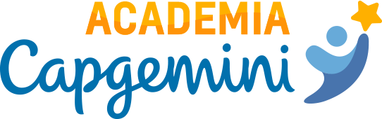

<div align="center">
    
</div>

## Sobre o projeto

O projeto foi desenvolvido para compor a terceira etapa do processo de seleção para a Academia Capgemini 2022.

## Feito com :rocket:

- [node](https://nodejs.org/en/) - utilizado para executar o Javascript.


## Pre requisitos

você precisa ter instalado o NodeJs, para instala-lo em seu computado, consulte: [node](https://nodejs.org/en/)

## Executar :fire:

### Baixar o projeto
```
git@github.com:Joely-Brito/desafio-academia-capgemini.git
```

na sequência, entre na pasta e execute os seguintes comandos

### Exercício 1
```
node ./exercicio-1.js 
```

### Exercício 2
```
node ./exercicio-2.js 
```

### Exercício 3
```
node ./exercicio-3.js 
```

<div align="center">
   Feito com amor, por: <a href="https://www.linkedin.com/in/joely-brito/" target="_blank">Joely Brito</a> ❤️
</div>